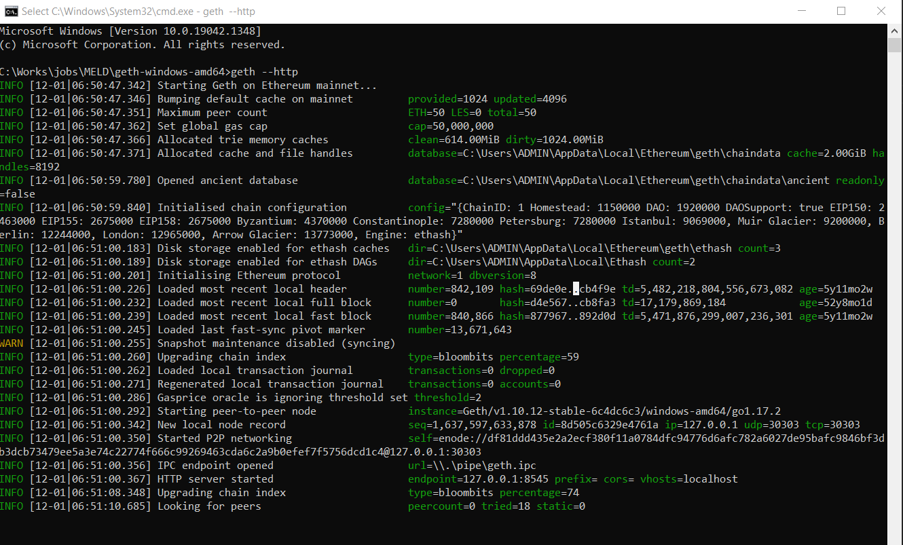
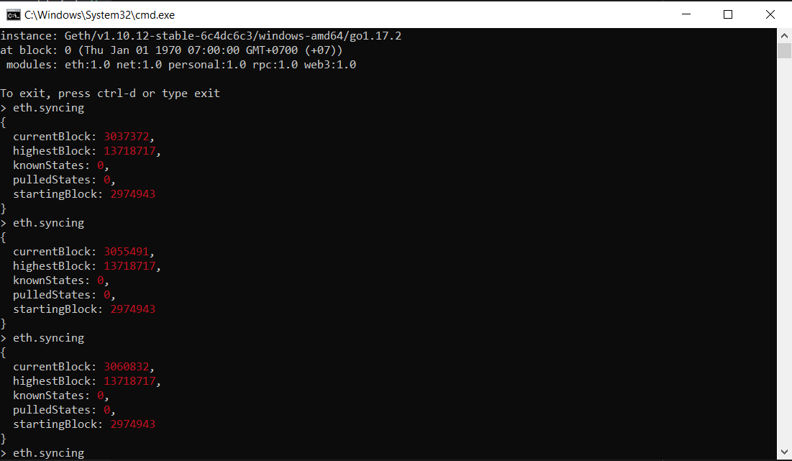

# DEX-scrapper
Scrapping Data from DEX


### Getting started

Start query data from main net by running command:

```bash
node main.js    
```

Example output:

| (index)| name  | midPrice | execution_price | updated_at |
|---|---|---|---|---|
| V3 USDC/USDT  | 'V3 USDC/USDT'  | '0.9993033488'  | '0.998'  | '2021-11-29 22:38:0'  |
|V3 BTC/USDC|'V3 BTC/USDC'|'57000.40786'|'56829.4'|'2021-11-29 22:38:0'|
|V2 ETH/DAI|'V2 ETH/DAI'|'4324.4'| '4311.38'|'2021-11-29 22:38:2'|
|...|...|...|...|...|


### Custom code and config


This project come with my default provider from Infura. You can change it to your provider in `config.js` :

```node
const url = '<Your new provider url here>';
const customHttpProvider = new ethers.providers.JsonRpcProvider(url);
```


In order to add more pair in Uniswap V2, you should add token address in `address.js` in adapter folder. For example:

```node
const usdt = '0xdAC17F958D2ee523a2206206994597C13D831ec7';
const sand = '0x3845badAde8e6dFF049820680d1F14bD3903a5d0';
```


In order to add more pair in Uniswap V3, you should add pool address in `address.js` in adapter folder. For example:

```node
const weth_usdt_pool_address = '0x4e68Ccd3E89f51C3074ca5072bbAC773960dFa36';
const usdc_usdt_pool_address = '0x3416cF6C708Da44DB2624D63ea0AAef7113527C6';
```

Here is the example of completed code in `main.js`:

```node
const { PairsProfileV2 } = require("./src/adapter/uniswap_v2/pair_profile");
const { PairProfileV3 } = require("./src/adapter/uniswap_v3/pair_profile")
const {PairsList } = require("./src/service/pairs_table")
const config = require("./config");
const token_address = require("./src/adapter/uniswap_v2/address");
const pool_addres_list = require("./src/adapter/uniswap_v3/address")

async function main(refresh_interval=3000) {

    let eth_dai = new PairsProfileV2("V2 ETH/DAI", config, token_address.weth, token_address.dai, '100000000000000000')
    let btc_dai = new PairsProfileV2("V2 BTC/DAI", config, token_address.wbtc, token_address.dai, '100000')
    let usdt_dai = new PairsProfileV2("V2 USDT/DAI", config, token_address.usdt, token_address.dai, '1')
    let usdc_dai = new PairsProfileV2("V2 USDC/DAI", config, token_address.usdc, token_address.dai, '1')
  
    let btc_usdc = new PairProfileV3("V3 BTC/USDC", pool_addres_list.btc_usdc_pool_address, "BTC", "USDC", 1000, 8)
    let weth_usdt = new PairProfileV3("V3 WETH/USDT", pool_addres_list.weth_usdt_pool_address, "WETH", "USDT", 1000000000000)
    let usdc_usdt = new PairProfileV3("V3 USDC/USDT", pool_addres_list.usdc_usdt_pool_address, "USDC", "USDT", 1000, 6)
  
    pair_list = new PairsList()
    pair_list.add(eth_dai)
    pair_list.add(btc_dai)
    pair_list.add(usdt_dai)
    pair_list.add(usdc_dai)
  
    pair_list.add(btc_usdc)
    pair_list.add(weth_usdt)
    pair_list.add(usdc_usdt)
    pair_list.run_interval(refresh_interval)
  }
  
main()
```

### Deploy on your own node


Instead of using Infura, you can use your own provider by using your own node in the config. Note: The project is for scrapping data and doing research on data. So this guide for deploying node on window only

First, you must get Go-Ethereum (*Official Go implementation of the Ethereum protocol-Geth*) on the installing website (https://geth.ethereum.org/docs/install-and-build/installing-geth) then download the version for your platform. The other way is directly cloning go-ethereum project in github (https://github.com/ethereum/go-ethereum)

Second, save `Geth.exe` file (for window) into a disk with at least 200GB free space (SSD recommended). Then run the follow code to deploy your node:

```bash
geth --http --http.api personal,eth,net,web3 --http.corsdomain "*" --graphql
```

- `--http` option will expose you node at your `http:\\localhost:8545`. This will be very useful when you need other user or computer connect to your node to do data research. Note: Due to security concern, use this way in a private network or add an authentication layer
- `--graphql` in case you want GraphQL
  
After that, you have a screen like this:



Then connect to Geth console `geth attach http://localhost:8545` and `eth.syncing`. If the command return `false` then the syncing process is complete and all block is downloaded. If not, the result will be:



Third, change the `url` in `config.js` file before running the code as normal

```node
// const url = 'https://mainnet.infura.io/v3/<your project iD>'; => use with infura
// const url = "\\\\.\\pipe\\geth.ipc";  => use if you need ipc connection only
const url = 'http://localhost:8545';  // use with http

const customHttpProvider = new ethers.getDefaultProvider(url);
```

Note: The syncing process will download about 100GB, and you must wait for 2-5 days to complete. If you does not wait and try to run the code, some error may occur such as `Error: call revert exception (method="factory()", ....`
